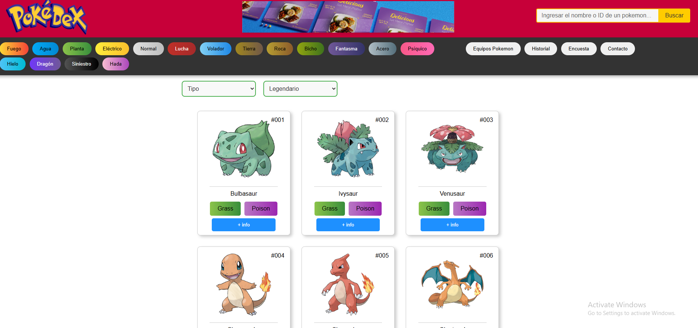

## Pokédex Pokemon



Una aplicación web tipo Pokédex desarrollada como proyecto para la materia de Aplicaciones Móviles en la universidad. Permite buscar y filtrar Pokémon, ver detalles y armar equipos personalizados.

---

### 🔧 Instalación

1. Cloná el repositorio.
2. Ejecutá el siguiente comando para instalar las dependencias:

```bash
npm install
```

3. Luego, ejecutá el siguiente comando para correr la aplicación localmente (acceder desde `http://localhost:3000`):

```bash
npm start
```

---

### 🚀 Funcionalidades principales

- Buscar por nombre o número de Pokédex.
- Filtrar por tipo, generación u otros atributos (opcionalmente).
- Al hacer clic en un Pokémon, muestra estadísticas, habilidades, descripción, tipo(s) e imágenes.
- Agregar Pokémon a un equipo personalizado para combinarlos y analizarlos.
- Visualizar el equipo armado y combinarlo según preferencias.

---

### 🧪 Detalles adicionales

- Desarrollo orientado a la materia de Aplicaciones Móviles, enfoques en UX y buenas prácticas de UI.
- Uso de jQuery donde se necesitó manipulación específica del DOM, complementando React.
- Responsivo para distintos tamaños de pantalla y dispositivos.

### ♻️ Posibles mejoras

- Implementar autenticación de usuarios con contraseñas.
- Guardar equipos en localStorage o back-end para persistencia.
- Agregar más filtros (peso, altura, estadísticas específicas).
- Integrar módulos offline para uso sin conexión.

---

### 🛠️ Tecnologías y herramientas utilizadas

- Frontend: React, JavaScript (incluye jQuery), HTML5, CSS3
- Estilos adaptados y responsivos para mejor UX
- pokeAPI utilizada para hacer las peticiones HTTP y obtener la información de los pokemones
---

¡Gracias por visitar este repositorio! 😊
